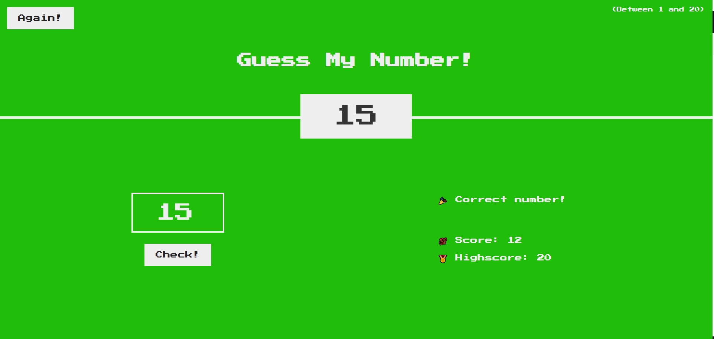

# Number Guess my number

## Overview
This web application is a **Guess my number** where players try to guess a number between 0 and 20 in as few attempts as possible. It is built using JavaScript, HTML, and CSS for a responsive and interactive user experience.

## Features
- User-friendly interface with HTML and CSS
- Real-time feedback on guesses
- Keeps track of the number of attempts

## Usage
1. Open the game in your web browser.
2. Enter your guess and submit it.
3. Try to guess the correct number in the fewest attempts!

